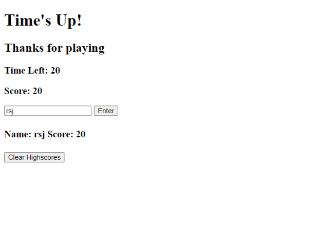

# Coding Quiz Game

## Description

This is a 5-question coding quiz to test the user's knowledge on foundational Front End concepts. The quiz has a 30 second timer. Each wrong answer deducts 5 seconds to the timer. Each correct answer is 5 points. At the end of the quiz, the user can input their initials and score to the highscore board.

## Installation / Usage

clone repo and access the index.html at the root

